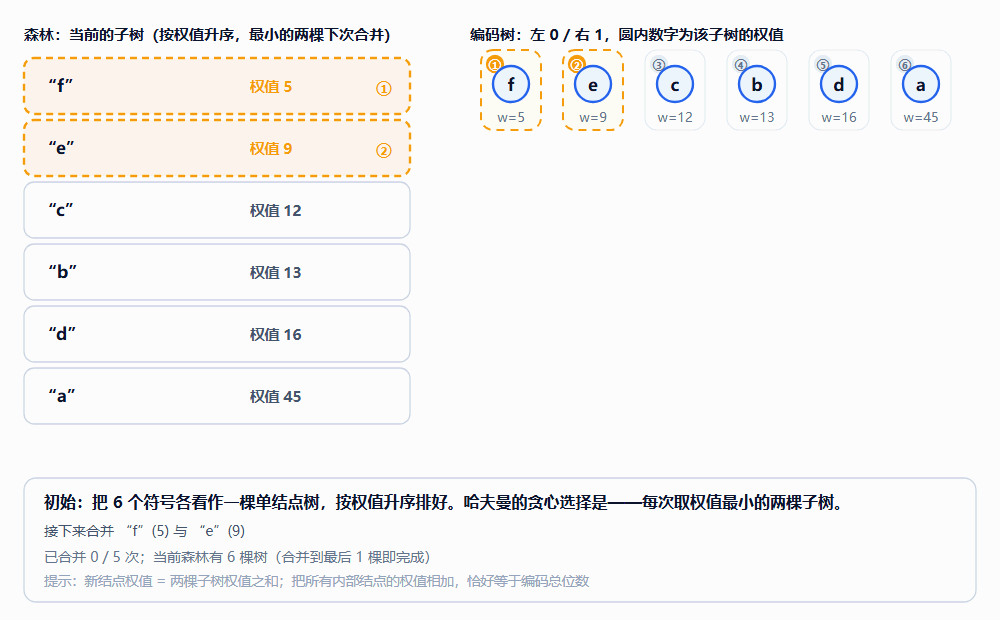

# 哈夫曼编码：最优性证明与动画演示

> 前置：二叉树、堆（优先队列）即可。本文回答两个问题：**哈夫曼编码为什么是最优的前缀码？** 以及**合并过程到底长什么样？**（配一个可交互动画 + 循环 GIF）
> 所有数字（码字、平均码长、熵、总位数）都由 `huffman/make_huffman_demo.py` 算出并自检，其中"最优性"另用穷举所有二叉树的动态规划独立核对。
> 第 5 节整合了工作区里 OI-Wiki《霍夫曼树》的内容（术语 WPL、算法四步、示例代码、配图），并补上竞赛常见的"合并果子"与 $k$ 叉霍夫曼；OI-Wiki 页面原文存档在 `huffman/oiwiki-霍夫曼树.md`。
> 术语提示：**哈夫曼 = 霍夫曼 = Huffman**，本文两种写法混用，指的是同一个东西；数据结构/竞赛教材多写"霍夫曼树 + WPL"。

---

## 0. 问题：变长前缀码

给一组符号和它们的出现频率（或概率）：

| 符号 | a | b | c | d | e | f |
|---|---|---|---|---|---|---|
| 频率 | 45 | 13 | 12 | 16 | 9 | 5 |

要用 0/1 串给每个符号编码，使得**平均码长最短**。定长编码需要 $\lceil\log_2 6\rceil=3$ 位：共 $3\times 100=300$ 位。
如果按频率分配长短码（频率高的给短码），可以更省——这正是哈夫曼编码做的事。

**前缀码（prefix code）**：任何码字都不是另一个码字的前缀。这样解码时从左往右读，一旦匹配到某个码字就可以立刻输出该符号，不会产生歧义。
（要求前缀码并不吃亏：McMillan 定理说明，任何唯一可译码都能改造成同码长的前缀码，所以"最优前缀码"＝"最优唯一可译码"。）

---

## 1. 模型化：前缀码 ⟺ 二叉树

- 一棵二叉树，**叶子**一一对应符号；
- 从结点走向**左孩子记 0、右孩子记 1**；
- 符号的码字 = 从根到该叶子的路径标签；**码长 = 叶子深度** $d_i$。

代价（加权外部路径长度）：

$$C(T)=\sum_{i=1}^{n} w_i\,d_i$$

> **这个量在数据结构 / 竞赛教材里叫"树的带权路径长度"（WPL）**：从根到各叶结点的**路径长度** $l_i$ 与该叶结点**权值** $w_i$ 的乘积之和，即 $WPL=\sum_{i=1}^{n}w_il_i$。本文的 $d_i$ 就是 OI-Wiki 里的 $l_i$，$C(T)$ 就是 $WPL$ —— 后面第 5 节按 OI 的习惯也用 WPL 这个记号。
> 于是"霍夫曼树"的定义可以直接写成：**给定一组确定权值的叶结点，WPL 最小的那棵二叉树**。

若 $w_i$ 是概率 $p_i$，则平均码长 $L(T)=C(T)$（因为 $\sum p_i=1$）；若是频数，则 $L(T)=C(T)/W$，$W=\sum w_i$。

两条常用事实（下文都会用到）：

1. **最优树的每个内部结点恰有两个孩子**：若某内部结点只有一个孩子，把它删掉、子树整体上提一层，所有相关叶子深度减 1，代价严格变小（要求 $w_i>0$）。
   用教材的说法就是：霍夫曼树里**只有叶结点的度为 0，其余结点的度均为 2**。
2. 有 $n$ 个叶子的满二叉树恰有 $n-1$ 个内部结点；并且

$$\boxed{\;C(T)=\sum_{\text{内部结点 }v} w(v)\;}\qquad w(v)=\text{以 }v\text{ 为根的子树中所有叶子的权值之和}$$

> 第 2 条就是动画底部那句提示：**把所有内部结点的权值加起来 = 编码总位数**。例子：$14+25+30+55+100=224$ ✓
> 顺带解释"权值越小离根越远"：由引理 1（交换引理）可知，把权值大的叶子换到浅处代价不会变大，所以在最优树里**大权值靠上、小权值靠下**——这正是 OI-Wiki《结构》一节的结论。

---

## 2. 动画演示

### 2.1 循环 GIF



*图 0　经典 6 符号例子（a=45, b=13, c=12, d=16, e=9, f=5）的 5 次合并。左栏是"森林"（当前所有子树，按权值升序，虚线黄框标出下次要合并的两棵），右栏是编码树（左 0 / 右 1，圆内是该子树权值），底栏是当前这一步的说明与最终统计。*

### 2.2 交互版（推荐）

打开 `huffman/huffman-demo.html`（双击即可，单文件、无外部依赖、离线可用）：

| 操作 | 说明 |
|---|---|
| `▶ 播放` / `⏸ 暂停`（或空格） | 自动逐步演示 |
| `◀ 上一步` / `下一步 ▶`（或 ←/→） | 手动单步，方便对照纸笔推导 |
| 速度滑杆 | 每步 1.4s ~ 0.52s |
| 三个预设 | 经典 6 符号、4 符号（可手算，只有 3 次合并）、斐波那契 8 符号（最深码长达 7） |

界面里能看到什么：

- **左栏卡片**：每个当前子树一行，显示叶子集合与权值；最小的两棵用橙色虚线框 + ①② 标出，新合并出来的那棵标"新结点"；
- **右栏树林**：每棵子树一个虚线框，框左上角的 ①②③… 与左栏一一对应；合并出来的内部结点会高亮并弹出；
- **底栏**：逐步说明（"第 k 步：合并 … + … → 新结点 …"），全部合并完成后给出码字表、平均码长 $L$、熵 $H$ 与校验 $H\le L<H+1$。

> 想直接截某一帧（做课件用）：在网址后面加参数即可，例如
> `huffman-demo.html?static=1&preset=0&step=3` 会只渲染第 3 步、并隐藏标题与按钮。

### 2.3 关键帧

| 初始（第 0 步） | 中途（第 2 步） | 完成（第 5 步） |
|---|---|---|
|  |  |  |
| 6 个单结点树，取最小的 f(5)、e(9) | 已合并出 ef(14)、bc(25)，正在建更大的子树 | 得到码字与 $L=2.24$、$H=2.22$ |

*图 1　第 0 / 2 / 5 步（同一份数据渲染，2 倍分辨率）。*

本例 5 次合并的完整过程：

| 步 | 合并 | 新结点权值 | 森林剩下 |
|---|---|---|---|
| 1 | f(5) + e(9) | 14 | 5 棵 |
| 2 | c(12) + b(13) | 25 | 4 棵 |
| 3 | ef(14) + d(16) | 30 | 3 棵 |
| 4 | bc(25) + def(30) | 55 | 2 棵 |
| 5 | a(45) + bcdef(55) | 100 | 1 棵 ✓ |

最终码字：`a:0  c:100  b:101  d:111  e:1101  f:1100`；总位数 224（定长编码 300），平均码长 $L=2.24$，熵 $H\approx2.22$。

---

## 3. 最优性证明

**算法（哈夫曼）**：把每个符号看作权值为 $w_i$ 的单结点树；重复「取出权值最小的两棵树，合并成一棵新树（权值 = 两者之和）压回」，直到只剩一棵树。

按 OI-Wiki / 数据结构教材的四步写法，同一件事可以说得更"流程化"（集合 $F$ 就是动画左栏那列卡片）：

1. **初始化**：由给定的 $n$ 个权值构造 $n$ 棵只有一个根结点的二叉树，得到二叉树集合 $F$。
2. **选取与合并**：从 $F$ 中选取根结点权值**最小的两棵**，分别作为左右子树构造一棵新二叉树，新根权值 = 左右子树根权值之和。
3. **删除与加入**：从 $F$ 中删除这两棵，把新树加入 $F$。
4. **重复** 2、3 步，直到 $F$ 中只剩一棵二叉树，它就是霍夫曼树。

设 $W=\sum_i w_i$，所有 $w_i>0$。下面证明它给出的树 $T_{\text{Huff}}$ 满足 $C(T_{\text{Huff}})=\min_T C(T)$。

### 3.1 引理 1（交换引理）

> **引理 1（交换引理）.** 固定树形，只把两个叶子 $a,b$ 的**符号标签互换**，代价的变化恰好是
> $$\Delta=C(T')-C(T)=(w_a-w_b)\,(d_b-d_a)$$
> 由此得到两个**方向相反**的结论（这一步最容易写反）：
> - 若 $w_a\le w_b$ 且 $d_a\le d_b$（**轻的又更浅**）：$\Delta\le0$ —— 交换后代价不增。也就是"把轻的挪到深处、重的挪到浅处"永远不会更差。
> - 若 $w_a\ge w_b$ 且 $d_a\le d_b$（**重的本来就更浅**）：$\Delta\ge0$ —— 交换反而更贵，说明"重的放浅处"这种安排是站得住的。

**证明.** 只有这两项发生变化：

$$\text{交换前：} w_a d_a + w_b d_b,\qquad \text{交换后：} w_a d_b + w_b d_a$$

$$\Delta=w_a d_b+w_b d_a-w_a d_a-w_b d_b=(w_a-w_b)(d_b-d_a)$$

两个因子 $w_a-w_b$ 与 $d_b-d_a$：**轻重与深浅同向**（轻的浅、重的深）时乘积 $\le0$；**反向**（重的浅、轻的深）时乘积 $\ge0$。$\blacksquare$

> 一句话：**最优树里权值与深度反序排列**——权越大越靠上。这也解释了 §1 里"权值越小离根越远"的结论。

> **它和排序不等式的关系（重要，别混淆）.** 引理 1 就是排序不等式"不断交换逆序对"证明的**两元素版本**，两者不矛盾、是同一件事：
>
> 排序不等式说，**固定深度集合**、只重新分配权值标签时，$\sum_i w_id_i$ 的最小值由
> "**权值从大到小排、深度从小到大排，同序号相乘**"取得。
> 本文数值核对（`make_huffman_demo.py` 的 `check_swap_lemma`）在经典例子的最优树形上验证了这一点：15 对叶子全部满足 $\Delta=(w_a-w_b)(d_b-d_a)$；满足"轻的又更浅"的配对Δ全 $\le0$，满足"重的更浅"的配对Δ全 $\ge0$；穷举全部 $720$ 种标号，最优代价 $224$ 恰好等于"权值降序配深度升序"的代价。
>
> 但要注意：**排序不等式本身不足以证明哈夫曼最优**。它只回答"给定树形后标签怎么贴"，**不回答树形（深度集合）该取哪个**——后者才是哈夫曼算法的战场。反例式的对照（权值 $\{1,2,3,4\}$）：
>
> | 树形（深度集合） | Kraft 和 | 按排序不等式的最优配对代价 |
> |---|---|---|
> | 完全平衡（$2,2,2,2$） | $1$ | $2(4+3+2+1)=20$ |
> | 毛毛虫形（$1,2,3,3$） | $1$ | $4\cdot1+3\cdot2+2\cdot3+1\cdot3=19$ |
>
> 两种深度集合都可行（Kraft 和都是 1），但后者更优；哈夫曼对 $\{1,2,3,4\}$ 的输出正是 $19$（脚本实测与穷举 DP 一致）。所以真正的证明必须靠**引理 3**（最小权值的两个符号放到最深、且互为兄弟——这一步才是"贪心选择"）＋**引理 4**（收缩后仍最优）＋归纳，而不能只靠排序不等式。

### 3.2 引理 2（最深的兄弟叶子存在）

> **引理 2.** 在内部结点都有两个孩子的二叉树中，存在两个叶子是**兄弟**且深度都等于最大深度 $D$。

**证明.** 取一个深度为 $D$ 的叶子 $u$。它的父亲有两个孩子，另一个孩子 $v$ 必然是叶子——否则 $v$ 有孩子，那个孩子的深度为 $D+1>D$，与 $D$ 是最大深度矛盾。$v$ 与 $u$ 同深度、同父亲，即为所求。$\blacksquare$

### 3.3 引理 3（贪心选择性质）

> **引理 3.** 设 $x,y$ 是两个**权值最小**的符号（$w_x\le w_y\le w_i$ 对所有 $i$）。则存在一棵最优树，其中 $x,y$ 是深度最大的兄弟叶子。

**证明.** 取一棵最优树 $T$。由引理 2，取其中深度最大（$=D$）的一对兄弟叶子，设它们的位置为 $u,v$，原标签为 $s_u,s_v$。

1. 把 $x$ 与位置 $u$ 上的标签互换。因为 $w_x\le w_{s_u}$（$x$ 权值最小）且 $d_x\le D=d_u$，引理 1 给出 $C(T_1)\le C(T)$，故 $T_1$ 也是最优树，且此时 $x$ 位于深度 $D$。
2. 再把 $y$ 与**当前位置 $v$ 上的标签**互换。$y$ 也是最小权值之一，故 $w_y\le w_{\text{该标签}}$；又 $y$ 的深度 $\le D=d_v$，引理 1 给出 $C(T_2)\le C(T_1)$，$T_2$ 仍最优。
   （若 $y$ 已经在 $v$ 上，这一步就是"与自己交换"，什么也没发生，同样成立。）

于是 $T_2$ 是最优树，且 $x,y$ 恰好落在 $u,v$ 两个位置上——它们是兄弟，深度同为最大的 $D$。$\blacksquare$

### 3.4 引理 4（最优子结构）

设最优树 $T$ 中 $x,y$ 是深度最大的兄弟叶子，父亲为 $p$。把它收缩：删掉 $x,y,p$，令 $z$ 为一个叶子、权值 $w_z=w_x+w_y$，得到规模为 $n-1$ 的问题上的树 $T'$。则

$$C(T)=C(T')+w_x+w_y$$

**证明.** $T$ 中 $x,y$ 的深度都等于 $d_p+1$（记 $z$ 的深度为 $d_p$），其余叶子的深度不变：

$$C(T)=\sum_{i\ne x,y}w_i d_i+\big(w_x+w_y\big)\big(d_p+1\big)
=\underbrace{\Big[\sum_{i\ne x,y}w_i d_i+w_z d_p\Big]}_{C(T')}+w_x+w_y \qquad\blacksquare$$

**推论（双射）.** "$x,y$ 为最深兄弟"的树与收缩后的树一一对应，两者代价相差常数 $w_x+w_y$。所以：

- $T$ 最优 $\iff$ $T'$ 最优（同一对应下）。

### 3.5 定理（哈夫曼算法最优）

> **定理.** 对任意正权值 $w_1,\dots,w_n$，哈夫曼算法输出的树是最优的：$C(T_{\text{Huff}})=\min_T C(T)$。

**证明**（对符号个数 $n$ 归纳）.

- **基础** $n=2$：只有一棵树，两个叶子深度都是 1，代价 $w_1+w_2$，显然最优。
- **归纳步**：设 $n\ge3$。算法第一步取两个最小权值符号 $x,y$（若有并列，取哪一对都行——引理 3 对任意一对最小权值符号都成立）。由引理 3，存在最优树 $T^{\ast}$ 使 $x,y$ 为最深兄弟。设 $T^{\ast\prime}$ 是它收缩后的树（新符号 $z$，$w_z=w_x+w_y$）。
  由引理 4 的推论，$T^{\ast\prime}$ 是规模 $n-1$ 问题的最优解（否则把更优解还原回去会得到比 $T^{\ast}$ 更优的树，矛盾）。
  而算法的**后续步骤恰好就是在解这个收缩后的问题**：森林里加入权值 $w_x+w_y$ 的新子树后，剩下的过程和直接对 $\{z\}\cup(\text{其余 }n-2\text{ 个符号})$ 跑哈夫曼完全一致。
  由归纳假设，算法在收缩问题上得到最优树 $\hat T'$。把 $x,y$ 作为 $z$ 的两个孩子接回去，就得到算法最终的树 $\hat T$，且

$$C(\hat T)=C(\hat T')+w_x+w_y=C(T^{*\prime})+w_x+w_y=C(T^*)$$

  即算法的输出达到最优值。$\blacksquare$

### 3.6 独立核对（本文数字怎么验的）

`make_huffman_demo.py` 里做了两件事：

1. **穷举最优**：对所有二叉树的形状做子集 DP
   $\mathrm{best}(S)=\min_{\varnothing\ne A\subsetneq S}\big[\mathrm{best}(A)+\mathrm{best}(S\setminus A)+w(S)\big]$，
   得到真正的最小代价（$n\le8$ 完全可行）。
2. **对照哈夫曼**：三个预设的最优值与哈夫曼总位数完全一致：

| 预设 | 哈夫曼总位数 | 穷举最优 | 结论 |
|---|---|---|---|
| 经典 6 符号 | 224 | 224 | ✓ 一致（最优） |
| 4 符号 | 35 | 35 | ✓ 一致（最优） |
| 斐波那契 8 符号 | 132 | 132 | ✓ 一致（最优） |

另外每个预设都检查了：Kraft 和 $=\sum 2^{-l_i}=1$ ✓、任意两个码字互不为前缀 ✓、$H\le L<H+1$ ✓。

---

## 4. 复杂度与实现细节

| 做法 | 合并 $n$ 个符号的复杂度 | 说明 |
|---|---|---|
| 每次线性扫描找最小两个 | $O(n^2)$ | 教学版；也正是"贪心"最直白的写法 |
| **最小堆（优先队列）** | $O(n\log n)$ | 标准实现：$n-1$ 次 pop/push |
| 输入已排序 + 两个队列 | $O(n)$ | 合并产生的新权值单调不减，可用普通队列接住 |

实现要点：

- 断平局要**稳定**（例如按 `(权值, 创建序号)` 排序），否则同一组频率可能画出不同的树（都最优，但不利于对照）；
- 合并后要把新结点**压回森林**再继续取最小——这一步错了就退化成固定策略；
- 解码用查表或走树，$O(\text{码长})$；
- 实际格式（DEFLATE、JPEG、MP3 等）常用**规范哈夫曼码（canonical Huffman）**：只传每个码长有多少个符号，码字按规则重建，省去存整棵树的代价。

---

## 5. OI 视角：WPL、合并果子与 k 叉霍夫曼（整合 OI-Wiki）

> 本节把工作区里 OI-Wiki《霍夫曼树》的内容并进来：术语 **WPL**、算法四步（见 §3 开头）、霍夫曼编码的构造、**四段示例代码**与三张配图都来自该页；页面原文（含署名与 CC BY-SA 4.0 协议说明）存档在 `huffman/oiwiki-霍夫曼树.md`，配图在 `huffman/oiwiki/`。
> 标注「补充」的小节是本文补的竞赛常见内容（OI-Wiki 该页未涉及）。

### 5.1 术语与记号对照

| 本文（编码视角） | OI-Wiki / 数据结构教材（树视角） |
|---|---|
| 符号的码长 $d_i$ | 叶结点的**路径长度** $l_i$（从根到该叶子的边数） |
| 代价 $C(T)=\sum w_id_i$ | **WPL** $=\sum w_il_i$（树的带权路径长度） |
| 叶子 = 符号 | 带权叶结点 |
| 内部结点恰好两个孩子 | 只有叶结点度为 0，其余结点度均为 2 |
| $O(n\log n)$ 合并 | 小根堆每次取最小的 $k$（$k=2$）个 |

### 5.2 WPL 长什么样（OI-Wiki 图 1）


*图 5　叶结点权值 $2,3,4,7$ 的一棵树：$WPL=2\times2+3\times2+4\times2+7\times2=32$（图与算式取自 OI-Wiki《霍夫曼树》，CC BY-SA 4.0）。*

### 5.3 构造过程与编码（OI-Wiki 图 2、图 3）

| 霍夫曼树的构造过程 | 由树读出编码 |
|---|---|
|  |  |

*图 6　左：每次合并权值最小的两棵树（对应本文的动画与证明）；右：左分支记 $0$、右分支记 $1$，从根到叶的路径就是该字符的编码。（图片取自 OI-Wiki，CC BY-SA 4.0。）*

OI-Wiki 给出的编码构造三步，和本文 §1 的模型完全一致：

1. 字符集 $d_1,\dots,d_n$，出现频率 $w_1,\dots,w_n$；
2. 以 $d_i$ 为叶结点、$w_i$ 为叶结点权值，构造霍夫曼树；
3. 左分支 $0$、右分支 $1$，从根到叶结点的 $0/1$ 序列即该字符的编码。

### 5.4 补充：合并果子 = 求 WPL 的最小值

**例题（NOIP 2004 提高组·合并果子）**：有 $n$ 堆果子，每堆个数为 $a_i$。每次可以把**任意两堆**合并成一堆，消耗体力等于两堆之和，求把所有果子合并成一堆的最小体力。

为什么它就是哈夫曼？把每堆果子看成叶结点、个数看成权值：合并两堆 = 给它俩造一个父亲，体力 = 新结点权值，而总消耗 = 所有内部结点权值之和 $=\sum a_i l_i=WPL$。于是"最小体力"就是**最小 WPL**，也就是哈夫曼树。

样例（OI 经典样例 $n=3$，果子 $1,2,9$）：先合并 $1+2=3$（消耗 3），再合并 $3+9=12$（消耗 12），合计 **15**。本文脚本实测：二叉树哈夫曼与穷举最优都是 **15** ✓；六个经典权值 $[5,9,12,13,16,45]$ 则都是 **224** ✓。

```cpp
// 合并果子：小根堆贪心，O(n log n) —— 等价于 OI-Wiki 的 getWPL(arr, n)
long long mergeFruit(int n, const vector<long long>& a) {
    priority_queue<long long, vector<long long>, greater<long long>> q(a.begin(), a.end());
    long long cost = 0;                       // 注意用 long long
    while (q.size() > 1) {
        long long x = q.top(); q.pop();
        long long y = q.top(); q.pop();
        cost += x + y;                        // 体力 = 新结点权值
        q.push(x + y);                        // 新堆压回
    }
    return cost;
}
```

> **易错点**：OI-Wiki 页面上的示例代码用的是 `int`，$n$ 较大时会溢出（$n\le10^4$、$a_i\le2\times10^4$ 时答案可达 $10^9$ 量级）。自己写时用 `long long`。

### 5.5 补充：k 叉霍夫曼树

若允许一次合并 **$k$** 个（$k$ 叉树），贪心要稍作修改：满 $k$ 叉树的叶子数必须满足 $L\equiv1\pmod{k-1}$，所以先补

$$\text{补零个数}=(-(n-1))\bmod(k-1)$$

个**权值为 0 的虚叶**，再每次合并最小的 $k$ 个。补零是为了让最后一次合并刚好凑够 $k$ 个孩子（否则最后会把不足 $k$ 个结点强行合并，反而更贵）。

实测（本文脚本用穷举所有满 $k$ 叉树的 DP 独立核对）：

| $k$ | 权值 | 补零个数 | $k$ 叉哈夫曼 WPL | 穷举最优 |
|---|---|---|---|---|
| 3 | 1,2,3,4,5 | 0 | 21 | 21 ✓ |
| 3 | 1,2,3,4 | 1 | 13 | 13 ✓ |
| 3 | 1,1,2,3,5,8 | 1 | 29 | 29 ✓ |
| 4 | 1,2,3,4,5,6 | 1 | 27 | 27 ✓ |

（$k=2$ 时 $k-1=1$，恒有 $(n-1)\bmod1=0$，不需要补零——所以二叉哈夫曼是特例。）

### 5.6 OI-Wiki 的四段示例代码（已实测）

下面四段代码**逐字取自 OI-Wiki《示例代码》一节**（我补了 `#define N 100` 与头文件，放进 `huffman/test_oiwiki_code.cpp` 编译运行，结果与本文 §3.6 的参考实现一致：两处 WPL 都是 224，码字为 `45→0, 12→100, 13→101, 5→1100, 9→1101, 16→111`，且验证了两两不互为前缀）。

**① 霍夫曼树的构建（线性扫描版，$O(n^2)$）**——对应 §3 算法第 1~4 步：

```c
typedef struct HNode {
  int weight;
  HNode *lchild, *rchild;
} * Htree;

Htree createHuffmanTree(int arr[], int n) {
  Htree forest[N];
  Htree root = NULL;
  for (int i = 0; i < n; i++) {  // 将所有点存入森林
    Htree temp;
    temp = (Htree)malloc(sizeof(HNode));
    temp->weight = arr[i];
    temp->lchild = temp->rchild = NULL;
    forest[i] = temp;
  }

  for (int i = 1; i < n; i++) {  // n-1 次循环建哈夫曼树
    int minn = -1, minnSub;  // minn 为最小值树根下标，minnsub 为次小值树根下标
    for (int j = 0; j < n; j++) {
      if (forest[j] != NULL && minn == -1) {
        minn = j;
        continue;
      }
      if (forest[j] != NULL) {
        minnSub = j;
        break;
      }
    }

    for (int j = minnSub; j < n; j++) {  // 根据 minn 与 minnSub 赋值
      if (forest[j] != NULL) {
        if (forest[j]->weight < forest[minn]->weight) {
          minnSub = minn;
          minn = j;
        } else if (forest[j]->weight < forest[minnSub]->weight) {
          minnSub = j;
        }
      }
    }

    // 建新树
    root = (Htree)malloc(sizeof(HNode));
    root->weight = forest[minn]->weight + forest[minnSub]->weight;
    root->lchild = forest[minn];
    root->rchild = forest[minnSub];

    forest[minn] = root;     // 指向新树的指针赋给 minn 位置
    forest[minnSub] = NULL;  // minnSub 位置为空
  }
  return root;
}
```

**② 求已建好的树的 WPL（递归）**——就是 $C(T)=\sum w_id_i$ 的直接翻译：

```c
int getWPL(Htree root, int len) {  // 递归实现，对于已经建好的霍夫曼树，求 WPL
  if (root == NULL)
    return 0;
  else {
    if (root->lchild == NULL && root->rchild == NULL)  // 叶节点
      return root->weight * len;
    else {
      int left = getWPL(root->lchild, len + 1);
      int right = getWPL(root->rchild, len + 1);
      return left + right;
    }
  }
}
```

**③ 不建树，直接用优先队列求 WPL**——这就是合并果子的写法（本文已把 `int` 换成 `long long`）：

```cpp
int getWPL(int arr[], int n) {  // 对于未建好的霍夫曼树，直接求其 WPL
  priority_queue<int, vector<int>, greater<int>> huffman;  // 小根堆
  for (int i = 0; i < n; i++) huffman.push(arr[i]);

  int res = 0;
  for (int i = 0; i < n - 1; i++) {
    int x = huffman.top();
    huffman.pop();
    int y = huffman.top();
    huffman.pop();
    int temp = x + y;
    res += temp;
    huffman.push(temp);
  }
  return res;
}
```

**④ 输出每个叶结点的编码（左 0 右 1）**——对应 §1 的"码字 = 从根到叶的路径"：

```c
void huffmanCoding(Htree root, int len, int arr[]) {  // 计算霍夫曼编码
  if (root != NULL) {
    if (root->lchild == NULL && root->rchild == NULL) {
      printf("结点为 %d 的字符的编码为: ", root->weight);
      for (int i = 0; i < len; i++) printf("%d", arr[i]);
      printf("\n");
    } else {
      arr[len] = 0;
      huffmanCoding(root->lchild, len + 1, arr);
      arr[len] = 1;
      huffmanCoding(root->rchild, len + 1, arr);
    }
  }
}
```

实测输出（`huffman/test_oiwiki_code.cpp`，权值 $45,13,12,16,9,5$）：

```
递归求 WPL（建好的树） = 224
小根堆直接求 WPL       = 224
两个结果都与参考值一致 : ✓

结点为 45 的字符的编码为: 0
结点为 12 的字符的编码为: 100
结点为 13 的字符的编码为: 101
结点为 5 的字符的编码为: 1100
结点为 9 的字符的编码为: 1101
结点为 16 的字符的编码为: 111
```

### 5.7 代码与理论的对应

| 代码 | 对应本文哪一节 | 说明 |
|---|---|---|
| ① 建树（线性扫描） | §3 算法四步 | 每次 $O(n)$ 找最小两个 → 总 $O(n^2)$；换小根堆即为 §4 的 $O(n\log n)$ |
| ② 递归求 WPL | §1 的 $C(T)$；引理 4 | 叶子处累加 $w\cdot depth$，正是加权外部路径长度 |
| ③ 优先队列求 WPL | §1 的 $C(T)=\sum_{\text{内部结点}}w(v)$ | 不建树，直接把每次合并的权值累加 |
| ④ 递归输出编码 | §1 前缀码 ⟺ 二叉树 | 左 0 右 1，根到叶的路径 |

---

## 6. 与熵的关系：$H\le L<H+1$

**Kraft 不等式.** 前缀码的码长 $l_1,\dots,l_n$ 必满足 $\sum_i 2^{-l_i}\le1$；反之，任何满足该不等式的正整数序列都能实现为前缀码。
（对树自底向上归纳：深度 $d$ 的叶子占用 $2^{-d}$ 的"概率预算"，兄弟合并时不超额。）

**下界 $L\ge H$.** 令 $K=\sum_j2^{-l_j}\le1$，$q_i=2^{-l_i}/K$，则 $q$ 是一个概率分布，且

$$0\le D(p\|q)=\sum_i p_i\log_2\frac{p_i}{q_i}
=\underbrace{\sum_i p_i\log_2\frac1{q_i}}_{=\,L+\log_2\frac1K}-H
\;\Longrightarrow\; L\ge H+\log_2 K\ge H$$

（最后一步因为 $K\le1$，$\log_2K\le0$。）

**上界 $L<H+1$.** 取 $l_i=\lceil\log_2(1/p_i)\rceil$，则 $\sum_i2^{-l_i}\le\sum_ip_i=1$，由 Kraft 存在这样的前缀码，其平均码长

$$L=\sum_i p_il_i<\sum_i p_i\Big(\log_2\frac1{p_i}+1\Big)=H+1$$

哈夫曼是该长度下的最优前缀码，所以 $L_{\text{Huff}}\le L<H+1$。

**合起来：** $\;H\le L_{\text{Huff}}<H+1$，且 $L_{\text{Huff}}=H$ 当且仅当所有 $p_i$ 都是 $2$ 的负整数次幂。

动画里的数字正落在这个区间：$H=2.2199\le L=2.24<3.2199$ ✓

> **注意边界**：这个界是"逐符号编码"的界。把 $k$ 个符号打包成一块再编码（分块哈夫曼），$L_k/k\to H$；算术编码/区间编码对长块可以任意接近 $H$，这也是它们比哈夫曼更省的原因——但哈夫曼在"每符号一个码字"的前缀码里已经是最优，没有更好的了。

---

## 7. 常见误区

1. **"哈夫曼树唯一"** — 不唯一。左右子树可以互换；有并列最小权值时可任选（都最优）。动画里斐波那契预设的 `a=b=1` 就是并列情形。
2. **"贪心一定最优"** — 贪心通常没保证，这里能保证是因为**引理 3 + 引理 4**：最小权值符号一定可以放在最深处（贪心选择性质），且收缩后问题独立（最优子结构）。这两条缺一不可。
3. **"码长可以很均匀"** — 最坏情况下最长码长可达 $n-1$：斐波那契权值 $1,1,2,3,5,8,13,21$（$n=8$）时最长码长就是 7，动画的第三个预设可以直接看到这条"链"。
4. **"频率低就可以不管"** — 权值必须 $>0$。若允许 $0$ 权值，最优树里可能出现单孩子结点，前面 3.1 节的约定要重述。（$k$ 叉哈夫曼里补的 $0$ 权虚叶是"占位"，不参与实际编码，所以不冲突。）
5. **"解码要回溯"** — 不需要：前缀性质保证从根往下走、遇到叶子就输出，然后回到根继续，绝不会歧义。
6. **"哈夫曼就是压缩的极限"** — 不是。它最优只是"逐符号前缀码"意义下的最优；分块与算术编码能突破 $H+1$ 的逐符号界。
7. **"$k$ 叉哈夫曼不用管叶子数"** — 要管：满 $k$ 叉树要求 $L\equiv1\pmod{k-1}$，不补 $0$ 权虚叶就会在最后一轮把不足 $k$ 个的结点硬合并，答案偏大（见 §5.5 的补零公式与实测表）。
8. **"合并果子用 `int` 就行"** — 答案可能到 $10^9$ 量级，务必 `long long`（OI-Wiki 示例代码是 `int`，直接抄到大 %数据上会溢出）。

---

## 8. 文件清单与重建

| 文件 | 作用 |
|---|---|
| `huffman/huffman-demo.html` | **交互动画**（单文件，双击即看，无外部依赖） |
| `huffman/huffman-demo.gif` | 循环动画（6 帧，约 190 KB） |
| `huffman/frames/step-*.png` | 每一步的静止画面（1 倍） |
| `huffman/frames2x/step-*.png` | 同上（2 倍，用于打印/课件） |
| `huffman/huffman-steps.json` | 每步的森林、树、码表数据（便于核对/二次开发） |
| `huffman/make_huffman_demo.py` | 参考实现 + 自检（含 §5 的合并果子、$k$ 叉核对）+ 生成 HTML |
| `huffman/capture_frames.ps1` | 用 Edge/Chrome 无头模式把每一步截成 PNG |
| `huffman/make_gif.py` | 纯标准库把 PNG 帧合成循环 GIF（含 LZW 回读自检） |
| `huffman/oiwiki-霍夫曼树.md` | **OI-Wiki《霍夫曼树》原文存档**（含署名与 CC BY-SA 4.0 说明） |
| `huffman/oiwiki/*.png` | 该页三张配图（§5.2、§5.3 引用） |
| `huffman/extract_oiwiki.py` | 从 `OI-wiki/` 构建产物里抽正文并还原 LaTeX 的小工具 |
| `huffman/test_oiwiki_code.cpp` | 把 OI-Wiki 四段示例代码原样编译运行，核对 WPL 与编码 |

```powershell
cd 讲义\huffman
python make_huffman_demo.py                 # 参考实现自检 + 生成 HTML/JSON
powershell -ExecutionPolicy Bypass -File .\capture_frames.ps1            # 1 倍帧
powershell -ExecutionPolicy Bypass -File .\capture_frames.ps1 -Scale 2 -OutDir frames2x
python make_gif.py --frames frames --out huffman-demo.gif               # 合成 GIF
python extract_oiwiki.py ds/huffman-tree --out oiwiki-霍夫曼树.md        # 重新抽取 OI-Wiki 原文
g++ -O2 -std=c++17 -o t test_oiwiki_code.cpp && ./t                     # 核对 OI-Wiki 示例代码
```

改例子的方法：编辑 `make_huffman_demo.py` 末尾 `main()` 里的三组 `build_preset(...)`，重跑上述命令即可（HTML、帧、GIF 全部同步更新）。

---

## 附：内容来源与许可

- **§5 整合自** OI-Wiki《霍夫曼树》 <https://oi-wiki.org/ds/huffman-tree/>（本机存于 `OI-wiki/ds/huffman-tree/index.html`）：
  WPL 的定义与算例、霍夫曼树的结构描述、霍夫曼算法四步、霍夫曼编码三步、四段示例代码、三张配图。
  该页内容按 **CC BY-SA 4.0** 协议提供（附加 SATA 条款），贡献者：Alex-McAvoy、1Wizzy、Ir1d、ksyx、StudyingFather。
  原文存档与配图已按协议保留署名，见 `huffman/oiwiki-霍夫曼树.md`。
- **§0~§4、§6~§8** 为本讲义原创整理：交换引理 → 贪心选择 → 最优子结构 → 归纳证明、Kraft 与熵界、
  交互动画与 GIF 的生成脚本，以及全部数值的自检（穷举 DP 核对最优性）。
- §5.4（合并果子）、§5.5（$k$ 叉哈夫曼）为本文补充，其结论同样用穷举 DP 独立核对过（见 §5.5 表格与脚本输出）。
